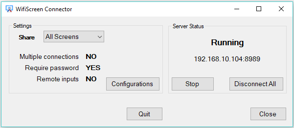
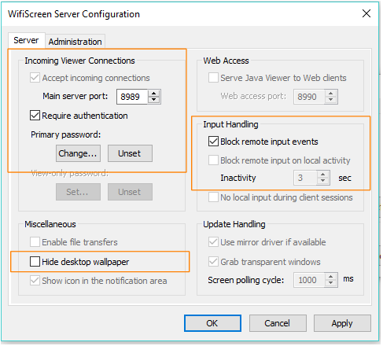

# wifiscreen
Using  iPad, tablet, iPhone, android devices or other computers as an extended monitor for Microsoft Windows

# Introduction

On Windows OS (7 and later), you are able to extend the second monitor even with only one physical monitor. 

How to turn on the second desktop: **[Windows Key] + P**, then select **Extend**

WifiScreen is an free and open source application that help Windows users can use their mobile devices as their second physical monitor.

This application is built on top of TightVNC with minimum configurations for extending screen purposes only. Thus, every devices and computers that can run a VNC Viewer application then can be used as an extended monitor.

# Usage
- Download the installations
-- 32bit Windows OS Installation
-- 64bit Windows OS Installation

- Run WifiScreen application
- Run VNC Viewer application on devices/computer then connect to the server:port as shown in the WifiScreen Connector.

## Settings
- Select a screen or all screens to share to other devices
- Multiple connections: Allow multiple devices connect to your shared screen (e.g: for seminar purpose)
- Require password: Authentication is required when a device want to connect.
- Remote inputs: you can use mouse/keyboard on the connected devices to input. 

The settings when click on Configurations button (you can only change the settings in the highlighted boxes)

Thanks to TightVNC team for the source code (https://www.tightvnc.com/download.php).
- Note: On this download page, you may want to try DFMirage Driver to improve WifiScreen Server performance (as they mentioned).

WifiScreen is an R&D project of http://www.3stone.vn/
